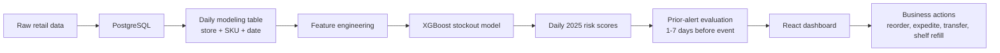

# ShelfSignal: Retail Stockout Early-Warning System

> Predict stockouts before they happen, explain why they are likely, and estimate the revenue protected by prior alerts.

<p align="center">
  <a href="https://rajashekarakula19-spec.github.io/retail-stockout-early-warning/">
    
  </a>
  <a href="https://github.com/rajashekarakula19-spec/retail-stockout-early-warning">
    
  </a>
</p>

<p align="center">
  
  
  
  
  
</p>

## 🔗 Live Links

| Resource | Link |
| --- | --- |
| 🚀 Live dashboard | [Open ShelfSignal](https://rajashekarakula19-spec.github.io/retail-stockout-early-warning/) |
| 📦 GitHub repository | [retail-stockout-early-warning](https://github.com/rajashekarakula19-spec/retail-stockout-early-warning) |
| 🧪 Demo dataset | [`data/anonymized_10_store_dataset/`](data/anonymized_10_store_dataset/) |
| 📝 Work summary | [`docs/work_summary.md`](docs/work_summary.md) |

> The GitHub Pages dashboard becomes live after the repo is pushed and **Settings > Pages > Source** is set to **GitHub Actions**.

## 🧠 What This Project Solves

Retail stockouts are expensive because they create lost sales, poor shelf availability, and reactive replenishment. ShelfSignal turns daily retail data into an early-warning system:

```text
Question:
Will this store-SKU stock out in the next 7 days?

Business action:
Alert early, explain the cause, and recommend reorder / transfer / shelf refill.
```

## ✨ Project Snapshot

| Area | What ShelfSignal Does |
| --- | --- |
| 🎯 Problem | Predicts future stockout risk for store-SKU-date combinations |
| 🧾 Data | Sales, inventory, replenishment, stockout events, products, stores, suppliers, promotions |
| 🧮 Model | Logistic Regression baseline + XGBoost main model |
| 📅 Validation | Train on 2024, score every active store-SKU daily in 2025 |
| 🚨 Alert logic | Checks whether each real 2025 stockout had a prior alert 1-7 days before the event |
| 💸 Business result | Estimates stockout revenue covered vs missed by prior alerts |
| 🖥️ Product | React dashboard with Overview, Risk Dashboard, Predictions, and Results pages |

## 📊 Current 10-Store Results

| Metric | Value |
| --- | ---: |
| Modeling rows | **584,571** |
| 2025 scored prediction rows | **291,833** |
| Active store-SKU pairs | **800** |
| Actual 2025 stockout events | **3,888** |
| Events covered by prior alerts | **3,876** |
| Missed events | **12** |
| Total 2025 stockout loss | **$6,264,446.53** |
| Revenue covered by prior alerts | **$6,245,380.68** |
| Missed revenue | **$19,065.85** |
| Average warning time | **6.8 days** |

## 🧭 Dashboard Pages

| Page | Purpose |
| --- | --- |
| 🏠 Overview | Project scope, model objective, data flow, and high-level business result |
| 📈 Risk Dashboard | Switchable 2024/2025 stockout analytics: revenue loss, events, lost units, causes, durations, products, and category revenue |
| 🔍 Predictions | Date-window store drill-down with product risk, forecast demand, probability, prediction result, root cause, and recommended action |
| ✅ Results | 2025 event-level evaluation: covered revenue, missed revenue, covered/missed root causes, and covered/missed durations |

## 🏗️ System Design



## 🧪 Modeling Approach

The model predicts:

```text
stockout_next_7d = 1 if a stockout occurs within the next 7 days
stockout_next_7d = 0 otherwise
```

Feature examples:

- Recent sales demand: last 7 and 14 days
- Average daily demand
- Current on-hand inventory
- Shelf and backroom inventory
- Days of supply
- Days since last replenishment
- Recent replenishment quantity
- Supplier lead time
- Historical stockout frequency
- Product, store, category, and promotion signals

The operating threshold is recall-oriented because missing a real stockout is more expensive than investigating an extra alert. The project also supports product-specific threshold adjustments for fast sellers, low days of supply, perishable categories, long lead times, stockout history, and replenishment patterns.

## 📦 Data

The full local project uses PostgreSQL schemas:

| Schema | Purpose |
| --- | --- |
| `retail_raw` | Raw operational tables |
| `retail_ml` | Modeling table, scored rows, outputs, recommendations, and metrics |

Main source tables:

- `sales_transactions`
- `inventory_snapshots`
- `replenishment_logs`
- `stockout_events`
- `products`
- `stores`
- `suppliers`
- `promotions`
- `store_layout`
- `demand_forecasts`

## 🛡️ Publishable Dataset

An anonymized 10-store dataset is included in:

```text
data/anonymized_10_store_dataset/
```

What was anonymized:

- Store names and direct identifiers
- SKU IDs, supplier IDs, transaction IDs, associate IDs
- Brand-like product names and barcode-style fields

What was retained:

- Dates
- Quantities
- Prices
- Product categories
- Inventory levels
- Replenishment behavior
- Stockout duration
- Root cause
- Lost revenue

Regenerate the publishable dataset from PostgreSQL:

```bash
DATABASE_URL=postgresql:///retail_stockout .venv/bin/python scripts/export_anonymized_10_store_dataset.py
```

## 🚀 Run Locally

Create the Python environment:

```bash
cd retail-stockout-early-warning
python3 -m venv .venv
source .venv/bin/activate
pip install -r requirements.txt
pip install -e .
```

On macOS, XGBoost may require OpenMP:

```bash
brew install libomp
```

Install frontend dependencies:

```bash
cd frontend
npm install
```

Create and load PostgreSQL:

```bash
createdb retail_stockout
DB_NAME=retail_stockout ./db/load_postgres.sh
```

Run the modeling pipeline from PostgreSQL:

```bash
DATABASE_URL=postgresql:///retail_stockout PYTHONPATH=src .venv/bin/python -m stockout_ews.pipeline --config config/project.yaml
```

If raw tables are already loaded and only model outputs need refresh:

```bash
LOAD_RAW=0 DB_NAME=retail_stockout ./db/load_postgres.sh
```

Start backend:

```bash
DATABASE_URL=postgresql:///retail_stockout .venv/bin/uvicorn backend.app.main:app --host 127.0.0.1 --port 8000
```

Start frontend:

```bash
cd frontend
VITE_API_BASE_URL=http://127.0.0.1:8000 npm run dev -- --host 127.0.0.1 --port 5173
```

Open locally:

```text
http://127.0.0.1:5173
```

## 🤖 Optional Ollama RAG Assistant

The dashboard can use Ollama for plain-English explanation of current data and model results. The assistant uses a lightweight RAG flow: it retrieves relevant PostgreSQL summaries and project markdown documentation, then sends that context to Ollama. If Ollama is offline, the app returns a fallback explanation.

```bash
ollama serve
ollama pull llama3.2
```

Check local RAG status:

```text
http://localhost:8000/api/rag/status
```

## 📏 Evaluation Metrics

The Results page reports:

- Precision
- Recall
- Accuracy
- Successful predictions
- False alerts
- Missed stockouts
- Revenue covered by prior alerts
- Missed stockout revenue
- Covered and missed root causes
- Covered and missed stockout durations

Recall is emphasized because the business cost of missing a stockout is higher than investigating a false alert.

## 🌐 Deploy to GitHub Pages

This repo includes a GitHub Pages workflow:

```text
.github/workflows/deploy-frontend.yml
```

After pushing to GitHub:

1. Open the repository on GitHub.
2. Go to **Settings > Pages**.
3. Set **Source** to **GitHub Actions**.
4. Push to the `main` branch.
5. GitHub Actions will build and publish the React app.

Live dashboard URL:

```text
https://rajashekarakula19-spec.github.io/retail-stockout-early-warning/
```

The public GitHub Pages build uses frontend fallback data if no backend URL is configured. For a fully backend-backed deployment, deploy FastAPI separately on Render, Railway, Fly.io, or AWS, then set:

```text
VITE_API_BASE_URL=<your-backend-url>
```

## 🧾 Repository Notes

- `frontend/dist/`, local virtual environments, model binaries, and generated processed tables are ignored.
- The anonymized 10-store CSV dataset is intentionally kept small enough for normal GitHub usage.
- The original full raw dataset should not be committed unless it is explicitly approved for public release.
